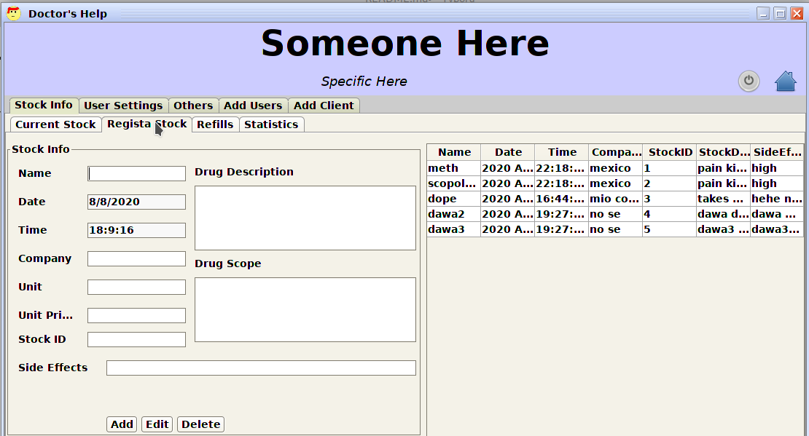

[TOC]

# Doctor-s-Help

This a simple tool i wrote to automate the working of a hospital.

```
This work is incomplete and much work is yet to be done. I'm not the best programmer and your ideas are highly appreciated.

The system auto makes the database and all the required table.

Default credentials are level<admin> admin admin

```


## Setting-up

For this work of art to run as expectedly  some instances should be running or installed and working.

They are 

- Java JDK
- MySQL

## Running the program

Firstly clone this repository by running 

```
git clone https://github.com/Niccher/Doctor-s-Help.git
cd dist
java -jar Highw.jar
```

# How it works

This program has many modules  and appears to be as one, the core ones are...

- ​	Admin part
  - This deals with the system configuration.
- ​	Doctor part
  - This deals with the system configuration.
- ​	Pharmacist part
  - This deals with the system configuration.


Doctor Module

This only has the capability of seeing a patient's history and committing a patient's case when he/she is administered.


Diagnosis screen is as follows


Medicine is selected from an istance that looks as below


# Admin Section

This is the most part with the most logiv within the system

the dashboard has all features active as below


 the Consultation button opens an instance similar to the doctor's instance which i have talked about it above in the doctor's section.

The other three consequent tabs are stil under active development.

The last setting feature is more of the tweaking module.

It has following contents arranged as tab:

- Stock info

  - This has further sub tabs within it 

    ​	Current Stock ->  Show a table of the stock(Drugs) available to offering the patients.

    ​		

    ​	Register Stock ->  Show a table of the stock(Drugs) avaailable to offering the patients. and a module that allows inserting new drugs(Medicines ) to the system.

    ​	

    ​	Refill Stocks -> Show a table of the stock(Drugs) available to offering the patients. And   a module that allows restocking new drugs(Medicines ) to the system.

    ​	

    ​	Statistics Tab -> Show a tab that show the most sold drugs and the price associated with them.

    ​			

- User Setting

  - This has other sub tab within , they are

    - Users

      ​	The logic within this displays the system users, they are all listed here with their details. It can be used to delete system users or update their account details.

      

    - Clients

      ​	The logic within this displays the system users, they are all listed here with their details. It can be used to delete client or update their account details.

      ​	

    - Activities

      ​	The logic within this displays the system log. It show when an event such as user created, New Stock Created, Stock refill etc.

      ​	

- Others

  - Has just several work assigned to it.
  - It has the backup functionality >> Dumps the SQL database into a file with can later be saved into the cloud
    - 
  - Also has the notification feature >> This modules listen constantly in the background and pops a low drug availability once the set number is met
    - 

- Add User

  - This tab has no nested tabs in it. As the name suggests it inserts a new system user in the system

    ​	

- Add Client

  - This tab has no nested tabs in it. As the name suggests it inserts a new client(Patient) user in the system

    ​	